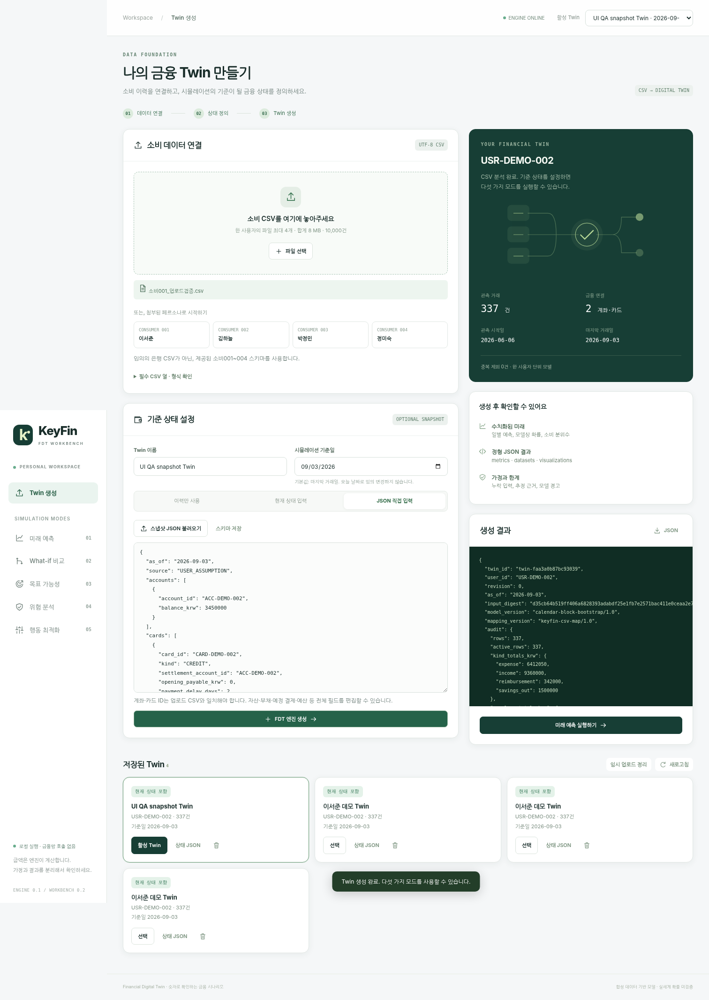
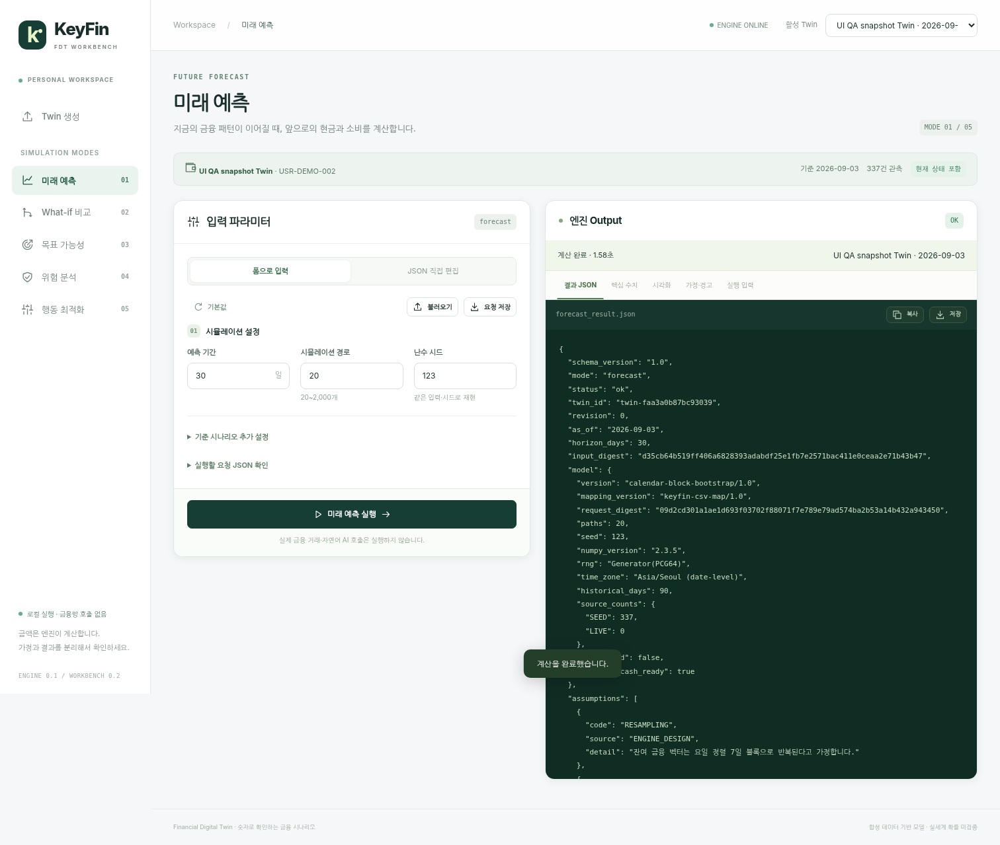
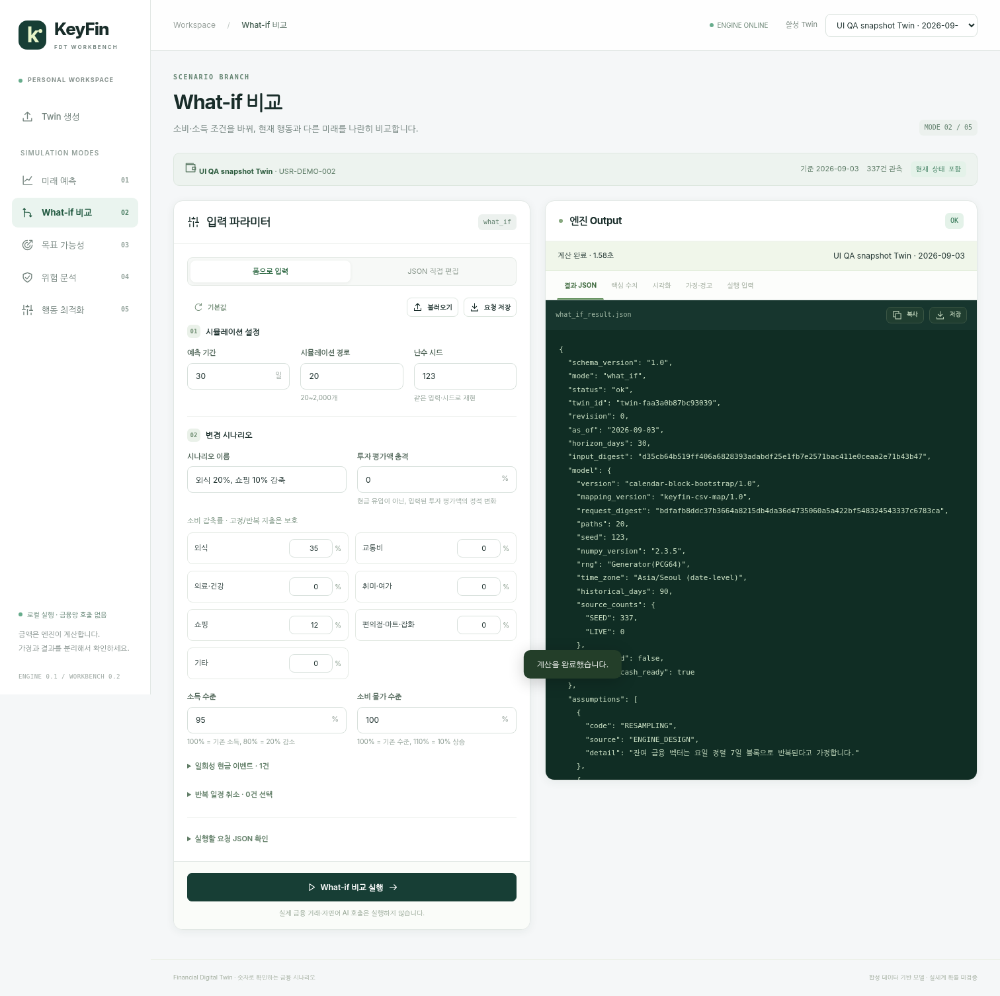
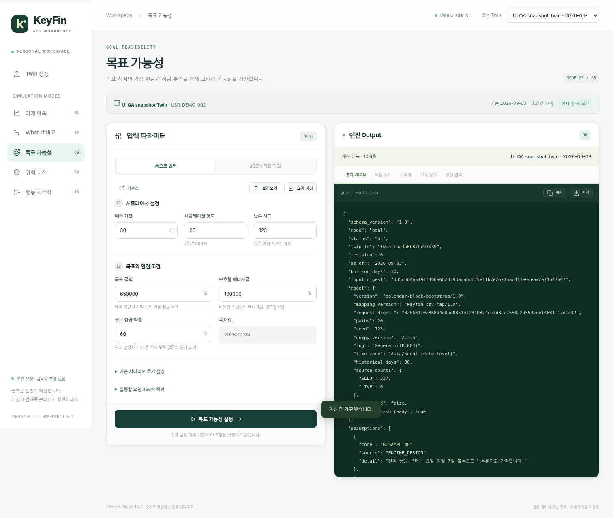
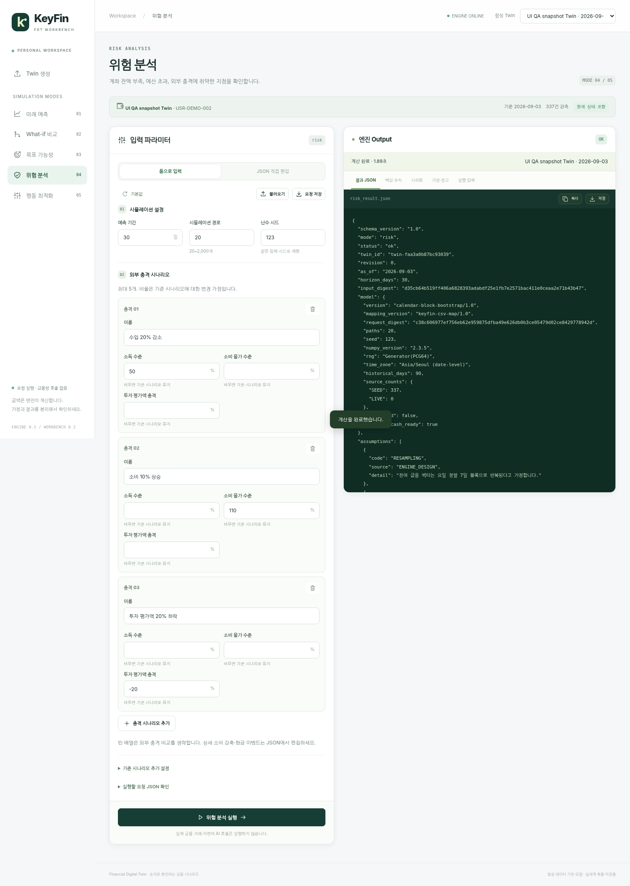
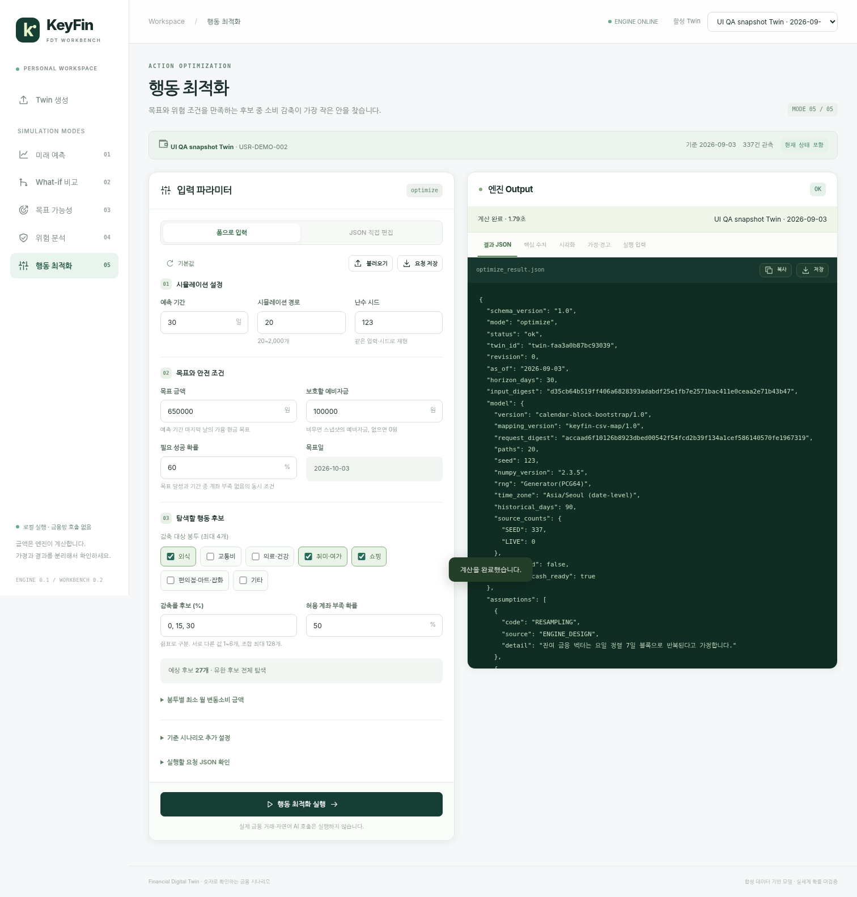
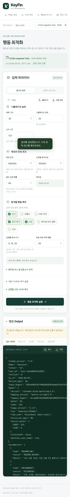
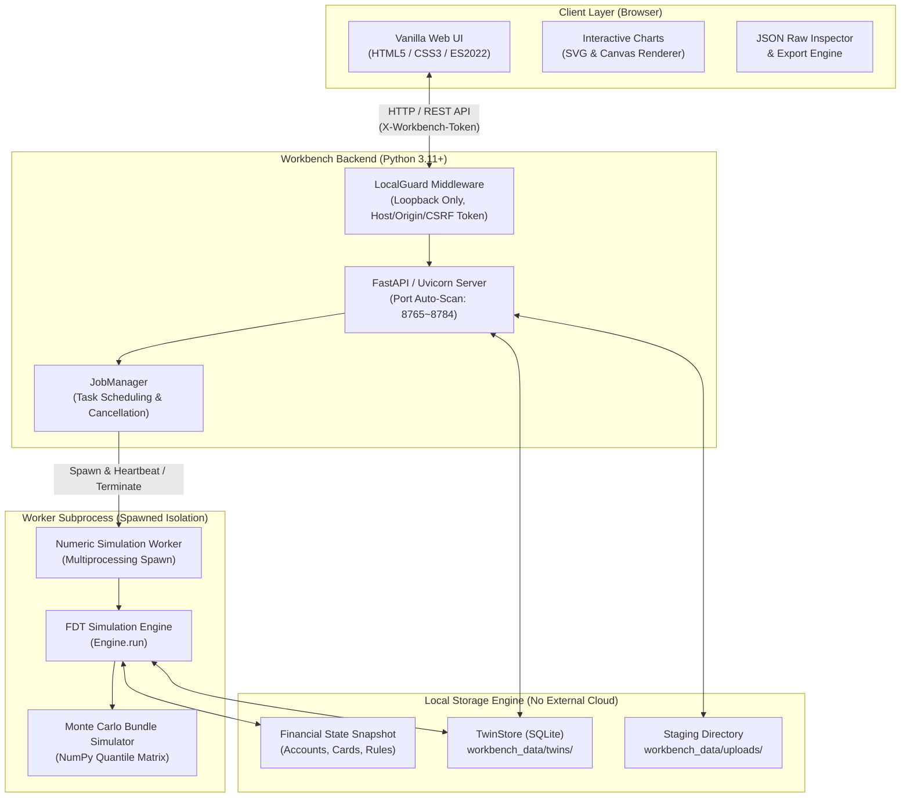

# 🏦 KeyFin FDT Workbench (v0.2)

> **개인 맞춤형 금융 디지털 트윈(Financial Digital Twin) 로컬 시뮬레이션 & 분석 워크벤치**  
> 소비 이력(CSV)을 기반으로 금융 자아(Twin)를 복제하고, 몬테카를로 경로 시뮬레이션을 통해 미래 예측·What-if 시나리오·재무 목표·위험 스트레스·지출 최적화를 인터랙티브하게 탐색합니다.

---

[](https://www.python.org/)
[](https://fastapi.tiangolo.com/)
[](https://www.sqlite.org/)
[](NOTICE.md)
[](QA_REPORT.md)
[](NOTICE.md)

---

## 📌 목차 (Table of Contents)

- [1. 프로젝트 소개](#1-프로젝트-소개)
- [2. 핵심 차별점 & 가치](#2-핵심-차별점--가치)
- [3. 5대 시뮬레이션 엔진 모드](#3-5대-시뮬레이션-엔진-모드)
- [4. UI & 시각화 갤러리](#4-ui--시각화-갤러리)
- [5. 시스템 아키텍처](#5-시스템-아키텍처)
- [6. 빠른 시작 가이드 (Quick Start)](#6-빠른-시작-가이드-quick-start)
- [7. 내 소비 데이터로 Twin 생성하기](#7-내-소비-데이터로-twin-생성하기)
- [8. 데모 페르소나 데이터셋](#8-데모-페르소나-데이터셋)
- [9. REST API 연동 가이드](#9-rest-api-연동-가이드)
- [10. 프로젝트 디렉터리 구조](#10-프로젝트-디렉터리-구조)
- [11. 보안 및 금융 정합성 원칙](#11-보안-및-금융-정합성-원칙)

---

## 1. 프로젝트 소개

**KeyFin FDT Workbench**는 개인의 실 소비 거래 내역(CSV)과 금융 스냅샷(자산·부채·카드 정산 정책)을 기반으로 **Financial Digital Twin(FDT)**을 구축하고, 통계적 수치 엔진과 몬테카를로 확률 시뮬레이션을 통해 다양한 미래 재무 상황을 검증하는 **로컬 웹 워크벤치**입니다.

기존 금융 앱의 단순 통계 조회를 넘어, **"내가 다음 달 외식을 20% 줄이면 어떻게 될까?", "이직이나 실직으로 소득이 30% 줄어들면 몇 일 만에 잔액 부족이 발생할까?", "3개월 내 300만원을 모으기 위해 어떤 소비 항목을 얼만큼 줄여야 할까?"** 와 같은 실제 금융 의사결정 시나리오를 직접 수치로 시뮬레이션할 수 있습니다.

```
[소비 거래 CSV] + [금융 상태 스냅샷]
          ↓
[Financial Digital Twin 생성 (SQLite)]
          ↓
[수치 계산 엔진 (독립 Spawn 프로세스)]
 ├── 1. 미래 예측 (Forecast)
 ├── 2. What-if 시나리오 비교
 ├── 3. 목표 달성 가능성 (Goal)
 ├── 4. 위험 스트레스 분석 (Risk)
 └── 5. 최적 소비 감축 플랜 도출 (Optimization)
          ↓
[인터랙티브 웹 차트 & 엔진 원문 JSON 제공]
```

---

## 2. 핵심 차별점 & 가치

| 핵심 가치 | 상세 설명 |
|---|---|
| 🔒 **100% Local & Zero Data Leakage** | 외부 클라우드, 금융 API, 상용 LLM 키가 전혀 필요하지 않습니다. 데이터는 로컬 `workbench_data/`의 SQLite에만 저장되며 외부 네트워크로 한 바이트도 유출되지 않습니다. |
| ⚡ **원클릭 자동 셋업 & 구동** | Windows는 `START.bat`, macOS/Linux는 `start.sh` 더블클릭만으로 독립 `.venv` 생성, 최적 의존성 설치, 포트 자동 할당(8765~8784), 브라우저 자동 실행까지 완전 자동화됩니다. |
| 🎲 **고정밀 몬테카를로 엔진** | 20~2,000개의 확률 경로(Path)를 시뮬레이션하여 단순 평균이 아닌 **P10(비관) / P50(중위) / P90(낙관)** 분위수 밴드 및 잔액 부족 확률(Shortfall Probability)을 제공합니다. |
| 🛡 **프로세스 격리 & 안전성** | CPU 집약적 연산은 FastAPI 부모 프로세스와 분리된 별도 자식 프로세스(`multiprocessing spawn`)에서 실행되며, 300초 타임아웃 및 즉각적인 작업 취소(`SIGINT/terminate`)를 보장합니다. |
| 📊 **Dual Input (웹 폼 + JSON)** | 직관적인 웹 폼 입력 방식과 개발자/연구자를 위한 원문 JSON 직접 편집·실시간 스키마 검증 모드를 동시에 지원합니다. |
| ⚖️ **엄격한 금융 데이터 정합성** | 잔액 미상 상태(`null`)를 임의로 `0`으로 왜곡하지 않으며, 데모 가정과 실데이터를 명확히 구분하여 잘못된 재무 판단을 원천 방지합니다. |

---

## 2-1. 고정지출 분리와 입력 계약 (v0.2, 매핑 2.0)

- 월세·관리비·전기·가스·수도·통신·인터넷·보험·사회보험·자동차세·구독·코워킹은 소비 봉투가 아니라 **고정지출 종류(`fixed_expense`)** 로 분리되어 6개 그룹(주거, 공과금, 통신, 보험·사회보험, 세금, 구독·멤버십)으로 집계됩니다. 잔액·현금흐름에는 그대로 반영되고, 봉투 통계·예산·감축 대상에서는 제외됩니다.
- CSV 입력은 금융망 기록 열과 KeyFin 확정 분류만 받습니다. `is_fixed`, `is_recurring`, `spend_pattern`, `classify_source` 열은 있어도 읽지 않고 `IGNORED_LABEL_COLUMNS` 경고만 냅니다. `direction`, `payment_method`, `exclude_tag`는 선택 열입니다.
- `confirm_status=PENDING` 소비는 잔액과 총소비에는 포함되고 봉투 통계에서는 제외됩니다. 비중이 5%를 넘으면 결과 `status`가 `partial`이 됩니다.
- 상세 계약: [docs/DESIGN_FIXED_EXPENSE_SEPARATION.md](docs/DESIGN_FIXED_EXPENSE_SEPARATION.md), [docs/IMPL_CONTRACT_FIXED_EXPENSE.md](docs/IMPL_CONTRACT_FIXED_EXPENSE.md), [docs/INTEGRATION.md](docs/INTEGRATION.md).

---

## 3. 5대 시뮬레이션 엔진 모드

KeyFin FDT 엔진은 사용자의 질문과 목적에 맞춘 **5가지 핵심 모드**를 제공합니다.

### 📈 1. 미래 예측 (`forecast`)
- **목적**: 현재의 소비 습관과 정기 지출이 이어질 때 미래 현금흐름과 자산 궤적을 확률적으로 예측합니다.
- **주요 입력**: 예측 기간 (1~365일), 몬테카를로 경로 수 (20~2,000개), 난수 시드(Seed).
- **출력 지표**: 일별 순현금흐름 분위수(P10/P50/P90), 카테고리별 누적 소비 분포, 잔액 부족 발생 확률.

### 🔀 2. What-if 시나리오 비교 (`what_if`)
- **목적**: 소비 감축, 소득 충격, 일회성 이벤트 등 금융 조건 변경 시 기본 미래와의 차이를 비교합니다.
- **주요 입력**:
  - 7대 소비 봉투별 감축률 (외식, 교통비, 의료·건강, 취미·여가, 쇼핑, 편의점·마트·잡화, 기타)
  - 고정지출 배율(`fixed_multiplier`)과 고정지출 규칙 금액 교체(`fixed_overrides`, 예: 월세 70만 → 75만)
  - 소득 배율 (예: 80%로 감소) / 소비 물가 배율
  - 일회성 현금 이벤트 (보너스 입금, 비정기 지출 등)
  - 정기 결제(구독, 통신비 등) 취소 여부
- **출력 지표**: 기본 시나리오 대비 절감액, 순자산 변화 delta, 잔액 부족 확률 감소폭.

### 🎯 3. 목표 달성 가능성 (`goal`)
- **목적**: 특정 기한 내 목표 자금을 달성할 수 있는지 확률을 평가하고 필요 전략을 제시합니다.
- **주요 입력**: 목표 금액 (원), 필수 예비자금 (Reserve), 목표 성공 확률 기준 (예: 80%).
- **출력 지표**: 목표 달성 확률 (`p_goal_reached`), 자금 부족 없는 안전 달성 확률, 예상 부족분 및 월 환산 필요 추가 저축액.

### ⚠️ 4. 위험 스트레스 분석 (`risk`)
- **목적**: 급격한 소득 단절이나 지출 급증 등 최악의 금융 스트레스 상황에서 버틸 수 있는 기간과 파산을 분석합니다.
- **주요 입력**: 최대 5개의 외부 충격 시나리오 (소득 급감률, 생활비 급증률, 투자자산 충격).
- **출력 지표**: 최저 잔액 예측치, 자금 고갈(Shortfall) 도달 시점, 충격 시나리오별 위험도 순위.

### ⚡ 5. 행동 최적화 (`optimize`)
- **목적**: 잔액 부족 위험을 최소화하고 목표를 달성하기 위한 **최적의 소비 감축 조합**을 자동 탐색합니다.
- **주요 입력**: 최적화 대상 봉투 (최대 4개), 감축률 후보 집합 (최대 6개), 최소 변동 소비 유지선, 허용 위험 한도.
- **출력 지표**: 최대 128개 후보 중 최적 감축안, 절감 효과, 달성 가능성 판정 (`feasible` / `infeasible`).

---

## 4. UI & 시각화 갤러리

KeyFin FDT Workbench는 모던하고 미려한 다크 테마 UI와 인터랙티브 시각화 차트를 제공합니다.

### 🗂️ Twin 생성 및 데이터 프로파일링
소비 거래 CSV를 업로드하면 즉시 거래 건수, 사용자 ID, 계좌/카드 수, 관측 기간 및 카테고리 분포를 자동 분석합니다.  


---

### 📊 5개 시뮬레이션 모드별 실행 화면

| 📈 미래 예측 (Forecast) | 🔀 What-if 비교 (What-if) |
|:---:|:---:|
|  |  |
| *몬테카를로 경로 시뮬레이션 및 분위수 밴드* | *소비 감축 및 소득 변동 시나리오 비교* |

| 🎯 목표 달성 가능성 (Goal) | ⚠️ 위험 스트레스 분석 (Risk) |
|:---:|:---:|
|  |  |
| *목표 도달 확률 및 만기 부족 자금 계산* | *복합 외부 충격 시뮬레이션 및 유동성 평가* |

| ⚡ 행동 최적화 (Optimization) | 📱 모바일 반응형 뷰 (Responsive) |
|:---:|:---:|
|  |  |
| *128개 조합 그리드 탐색 기반 최적 감축안* | *스마트폰 및 태블릿 1열 최적화 레이아웃* |

---

## 5. 시스템 아키텍처



---

## 6. 빠른 시작 가이드 (Quick Start)

### 💻 Windows 환경 (가장 권장)

**사전 준비물**: Python 3.11 이상 64-bit ([python.org](https://www.python.org/downloads/)) 및 Chrome / Edge 브라우저.  
*(Python 설치 시 반드시 `Add Python to PATH`를 체크하세요.)*

1. 본 저장소를 클론하거나 다운로드합니다.
2. 루트 폴더의 **`START.bat`**를 더블클릭합니다.
3. 최초 실행 시 자동으로 `.venv` 가상환경을 구성하고 필수 라이브러리를 설치한 뒤 브라우저가 자동 실행됩니다.
4. 기본 접속 주소는 `http://127.0.0.1:8765`입니다.

```bat
:: 옵션 실행 예시
START.bat --port 8899          # 특정 포트 지정 실행
START.bat --no-browser         # 브라우저 자동 실행 끄기
START.bat --data-dir "D:\Data" # 데이터 저장 디렉터리 변경
```

> **서버 종료 방법**:  
> BAT 실행 콘솔 창을 클릭하고 **`Ctrl + C`**를 누르면 실행 중인 시뮬레이션 워커와 웹 서버가 안전하게 종료됩니다.

---

### 🐧 macOS / Linux 환경

```bash
# 실행 권한 부여 및 원클릭 런처 실행
bash start.sh

# 종료: 터미널 창에서 Ctrl + C
```

---

### 🛠️ 개발자 수동 실행 및 테스트

가상환경을 수동으로 제어하고 싶거나 CI/CD 파이프라인에서 테스트할 경우:

```bash
# 1. 의존성 설치
python -m pip install -r requirements-web.lock

# 2. 서버 실행
python launcher.py --no-install --no-browser --port 8765

# 3. 전체 테스트 스위트 실행 (260개 단위/통합 테스트)
python -m pip install -r requirements-qa.txt
python -m pytest -q
```

---

## 7. 내 소비 데이터로 Twin 생성하기

1. **상단 메뉴에서 `Twin 생성` 클릭**
2. **소비 내역 CSV 파일 업로드**:
   - `data/demo/consumer_001.csv` 등 샘플 CSV를 드래그하거나 본인의 거래 CSV를 선택합니다.
   - 단일 사용자 거래, 최대 4개 파일, 총 8MB / 10,000건까지 지원합니다.
3. **상태 입력 방식 선택**:
   - **이력만 사용**: CSV 거래 내역만으로 트윈을 생성합니다. (과거 지출 패턴 및 흐름 파악)
   - **현재 상태 입력 (간편 폼)**: 계좌별 시작 잔액, 신용카드 결제일/미결제액, 예비자금을 입력합니다.
   - **JSON 직접 입력**: 복수 계좌, 부채, 투자 평가액, 복수 정기 청구서가 포함된 전체 금융 스냅샷을 적용합니다.
4. **`FDT 생성` 클릭**: 1~2초 내에 트윈이 빌드되고 활성 트윈으로 등록됩니다.

---

## 8. 데모 페르소나 데이터셋

테스트를 즉시 진행해볼 수 있도록 4가지 대표 금융 페르소나 샘플 데이터가 기본 내장되어 있습니다.

| ID | 이름 | 페르소나 설명 | 특징 및 관찰 포인트 |
|:---:|:---:|---|---|
| `001` | **이서준** | 31세 · 직장인 · 1인 가구 | 안정적인 급여와 규칙적인 소비, 신용카드 위주 정기 결제 |
| `002` | **김하늘** | 24세 · 대학생 · 아르바이트 | 불규칙한 아르바이트 소득, 체크카드 위주, 단기 유동성 민감 |
| `003` | **박정민** | 42세 · 프리랜서 · 자녀 1명 | 비정기 수입, 가족 생활비·자녀 교육비 등 고정 지출 비중 높음 |
| `004` | **정미숙** | 61세 · 은퇴 교사 · 연금 소득 | 연금 중심의 고정 수입, 의료·건강 지출 비중 및 예비비 관리 중요 |

> `Twin 생성` 화면 상단의 **`CONSUMER 001~004`** 버튼을 누르면 1초 만에 해당 데이터셋과 권장 스냅샷 가정이 자동 로드됩니다.

---

## 9. REST API 연동 가이드

KeyFin FDT Workbench는 외부 프론트엔드나 백엔드 서비스와 쉽게 연동할 수 있는 RESTful API를 제공합니다.

### 🔗 주요 엔드포인트 목록

| Method | Endpoint | 설명 |
|---|---|---|
| `GET` | `/api/health` | 서버 상태, 구동 PID, 버전 확인 |
| `GET` | `/api/config` | 5개 모드 템플릿, 스키마, CSRF 세션 토큰 확인 |
| `POST` | `/api/uploads` | 거래 CSV 멀티파트 업로드 및 사전 프로파일링 |
| `POST` | `/api/twins` | 신규 Twin 생성 비동기 Job 등록 |
| `GET` | `/api/twins` | 로컬에 저장된 Twin 목록 조회 |
| `POST` | `/api/twins/{id}/runs` | 5대 모드 시뮬레이션 요청 제출 (Job ID 반환) |
| `GET` | `/api/jobs/{id}` | 실행 중인 계산 작업 상태 및 경과 시간 폴링 |
| `POST` | `/api/jobs/{id}/cancel` | 진행 중인 수치 연산 워커 즉시 중단 |
| `GET` | `/api/jobs/{id}/result` | 엔진 시뮬레이션 완료 결과 원문 JSON 수신 |

### 🐍 Python 클라이언트 호출 예제

```python
import time
import httpx

BASE_URL = "http://127.0.0.1:8765"

with httpx.Client(base_url=BASE_URL, timeout=30) as client:
    # 1. 세션 토큰 발급
    token = client.get("/api/config").json()["token"]
    client.headers["X-Workbench-Token"] = token

    # 2. 저장된 Twin 목록 확인
    twins = client.get("/api/twins").json()["twins"]
    twin_id = twins[0]["id"]

    # 3. 미래 예측(Forecast) 60일 시뮬레이션 요청
    run_resp = client.post(f"/api/twins/{twin_id}/runs", json={
        "mode": "forecast",
        "horizon_days": 60,
        "paths": 200,
        "seed": 42
    })
    job_id = run_resp.json()["id"]

    # 4. 완료 대기 (비동기 폴링)
    while True:
        job = client.get(f"/api/jobs/{job_id}").json()
        if job["status"] == "succeeded":
            break
        elif job["status"] in ("failed", "cancelled"):
            raise RuntimeError(f"Job failed: {job.get('error')}")
        time.sleep(0.3)

    # 5. 결과 JSON 수신
    result = client.get(f"/api/jobs/{job_id}/result").json()
    print("예측 지표 요약:", result["metrics"])
```

---

## 10. 프로젝트 디렉터리 구조

```text
06_KeyFin_FDT_Workbench_v2/
├── fdt/                        # 🧠 Financial Digital Twin 수치 시뮬레이션 엔진
│   ├── engine.py               # 5대 모드 실행 진입점 (Engine.run)
│   ├── simulation.py           # 몬테카를로 경로 확률 시뮬레이터
│   ├── model.py                # Twin 상태 모델 및 불변 금융 데이터 구조체
│   ├── ingest.py               # 거래 CSV 파싱, 정제 및 검증기
│   ├── store.py                # SQLite 기반 Twin 데이터 저장소
│   ├── mapping.py              # 7대 소비 봉투 매핑 규칙 (외식, 교통 등)
│   └── schemas/                # JSON Schema (Request, Result, Snapshot)
│
├── workbench/                  # 🌐 로컬 웹 서버 및 프론트엔드
│   ├── app.py                  # FastAPI 웹 서버 및 LocalGuard 미들웨어
│   ├── jobs.py                 # 수치 계산 자식 프로세스(Spawn) 수명 관리
│   ├── locking.py              # 데이터 디렉터리 중복 실행 방지 파일 락
│   └── static/                 # 순수 바닐라 웹 프론트엔드 (Zero npm/Node)
│       ├── index.html          # SPA 반응형 대시보드
│       ├── app.js              # 폼 제어, JSON 동기화, 비동기 폴링 로직
│       ├── charts.js           # 분위수 밴드, 막대, 분포 시각화 엔진
│       └── app.css             # 모던 다크 테마 디자인 시스템
│
├── data/demo/                  # 📂 테스트용 데모 페르소나 CSV (001~004)
├── examples/                   # 💡 모드별 Request / Snapshot 샘플 JSON
├── docs/                       # 📖 상세 기술 명세, API 규격 및 아키텍처 문서
├── qa/                         # 📸 UI 캡처 스크린샷 및 테스트 검증 보고서
├── tests/ & tests_web/         # 🧪 260개 엔진 및 웹 API 단위/통합 테스트
├── launcher.py                 # 🚀 통합 Python 구동기 (의존성·포트 검사)
├── START.bat                   # 🪟 Windows 1-클릭 실행 배치 스크립트
├── start.sh                    # 🐧 macOS/Linux 실행 셸 스크립트
└── pyproject.toml              # 📦 프로젝트 패키지 메타데이터
```

---

## 11. 보안 및 금융 정합성 원칙

1. **로컬 루프백 전용 바인딩**:
   서버는 기본적으로 `127.0.0.1`에만 바인딩되며, 외부에서의 비인가 접근(`Host`, `Origin` 불일치)을 원천 차단합니다.
2. **세션 쓰기 보호 (`X-Workbench-Token`)**:
   웹 UI와 서버 간 일회성 세션 토큰을 검증하여 로컬 웹 브라우저 탭 간 CSRF 공격을 방지합니다.
3. **독립 프로세스 타임아웃 보호**:
   대규모 연산(예: 2,000경로 × 365일) 중 브라우저가 닫히거나 과부하가 발생할 경우 300초 타임아웃 또는 즉각 취소 명령을 통해 자식 프로세스를 정리하고 메모리를 회수합니다.
4. **금융 왜곡 방지 원칙**:
   - 거래 내역에 없는 계좌 잔액을 임의로 `0`원으로 처리하지 않고 `null`로 보존합니다.
   - 부족한 데이터로 인한 잘못된 재무 판단을 방지하기 위해 `insufficient_data` 및 `infeasible` 상태를 명확히 사용자에게 보고합니다.

---

<p align="center">
  <b>KeyFin FDT Workbench</b> · Personal Financial Digital Twin Engineering<br>
  Designed & Engineered for High-Precision Financial Simulation
</p>
