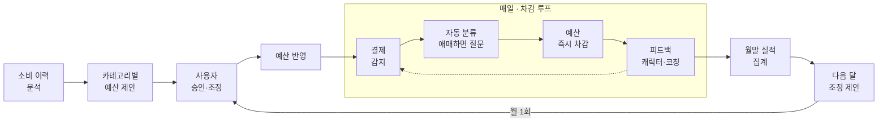

# KeyFin

> **소비 내역을 분석해 카테고리별 예산을 안내하고, 나갈 돈은 알아서 챙겨주는 — 계획적인 소비 습관을 만들어주는 생활 금융 관리 서비스**
> 

---

## 1. 기획 배경 및 문제 상황

**"계획된 소비가 어려운 건 의지의 문제가 아니라 구조의 문제다."**

- 가계부는 "기록"과 “반성”에서 끝난다. 가계부를 켜는 순간은 이미 돈을 쓴 다음이다. 기록은 과거를 보여줄 뿐, 다음 소비의 개선 방안을 구체화하기 어렵다.
- 소비의 금액과 시점은 일정하지 않은데, 지출은 여러 카드·계좌·결제수단에 흩어져 있다.
→ **"이번 달에 얼마를 더 써도 되는지"를 알기 어렵다.**
- 월세·통신비·구독료·카드 대금은 각기 다른 계좌에서 각기 다른 날 빠져나간다.
→ 결제일마다 잔액을 확인하고 돈을 옮기는 일을 사람이 직접 해야 하고, 놓치면 **미납·연체**가 된다.
- 설령 부지런히 기록하더라도, 장부 작성은 그 자체로 보상이 없는 노동이다. 앱을 여는 일이 숙제가 되고, 습관으로 이어지기 어렵다. 며칠만 빠뜨려도 공백이 부담이 되어 다시 열지 않게 된다.
→ **꾸준함이 생명인 돈 관리에, 꾸준하게 만들 장치가 정작 빠져 있다.**

### ***“단순 기록 앱이 아닌, 소비 습관을 만들어주는 앱”***

## 2. 문제 상황

| 문제 | 원인 | 그래서 필요한 것 |
| --- | --- | --- |
| **기록이 소비를 바꾸기 어렵다** | 가계부는 사용자가 **직접 기록하고 반영을 마친 뒤에야** 소비 현황을 보여준다 → 기록하지 않으면 **보완**도 없다 | 남은 예산이 **항상 보이는 상태** + 결제 **직후** 즉시 차감·피드백
→ 다음 소비 전에 판단 근거가 도착한다 |
| **얼마를 더 써도 되는지 모른다** | 결제마다 **사용 목적**이 다르고, 신용카드는 쓴 날과 나가는 날이 분리된다. | 결제수단과 무관하게 **카테고리별 예산**을 ****하나로.
→ 신용카드는 **승인 시점에 차감**하고, 다가올 **청구 예정액을 매일 계산**해 함께 보여준다 |
| **미납·연체가 생긴다** | **지출 계획**과 **실제 이체** 사이를 매번 사람이 **수동**으로 관리한다 | 출금 일정과 필요한 금액을 **자동(계산 + 이체)**으로 준비한다. |
| **지속적인 기록이 어렵다** | 기록은 재미가 없고, 노력에 비해 효용도 작다
 → 지속 동기의 부재 | 기록은 자동화하고, 지키는 행동에 **보상을 붙이는 동기 장치** |

## 3. 서비스 기능

### ① 예산 봉투 기반 소비 가이드

- 계좌·카드 거래 내역을 자동 수집·분류(7개 카테고리)하고, 소비 패턴에 맞는 **카테고리별 예산을 AI가 제안**하고, 사용자는 이후 승인, 조정한다
- 결제수단과 무관하게 소비가 발생하면 해당 봉투에서 차감 → **남은 예산이 실시간으로 보인다**
- 애매한 결제는 코치가 물어보고(”방금 밥뭇냥?", “밥 먹은겨~?”, “밥 먹었시봉?”), 미응답 건은 저녁에 일괄 정리 → 답할수록 분류가 나를 학습(확장성)
- 월간 리포트 + 다음 달 예산 조정 제안 + 절감 포인트(정책 기반? → 서울 시 AI 구독 지원) 안내

### ② 정기 지출 관리

- 정기 결제·구독·카드 대금·대출 이자의 **출금 일정과 필요 금액을 한 곳에 통합**
- 결제일 전에 수입 계좌에서 지정 결제 계좌로 **필요 금액을 자동 이체** → 미납·연체 원천 차단
- 자동화 범위는 **"본인이 지정한 본인 계좌 간, 정기 지출 준비"**로 한정 → 소비 차단 X

### ③ 방·캐릭터·AI 코치(게이미피케이션)

- **홈 화면 = 내 방**: 벽 보드에 예산 진행률, 캘린더에 출금 일정
- **아바타**: 소비 카테고리에 따라 반응(쇼핑백, 약봉투…), 예산 상태를 표정·행동으로 표현
- **AI 고양이 코치**: 우려되는 결제 감지 시 코칭(도도냥/온순냥/지방냥 — 말투 선택), 카테고리 질문의 화자
- **코인 보상**: 출석·카테고리 정리·예산 준수로 코인 획득(일/주/월 3단계) → 방·캐릭터 꾸미기.
**금액이 아니라 "지켰는가"만 보상** — 소득 규모와 무관하게 공평

### ④ 맞춤 추천(확장 기능)

- 사용자 조건에 맞는 지원 정책, 소비 습관에 맞는 금융 상품 추천

## 4. 차별성

| 서비스 | 기능 | KeyFin과 공통점 | KeyFin만의 차별성 |
| --- | --- | --- | --- |
| **토스 자산관리** | 여러 금융기관 자산 통합, 소비 캘린더, 소비 분석, 고정 지출·카드 청구서 알림 | 자산 통합, 소비 분석, 예정 지출 알림 | 토스는 **알려주는 데서 끝난다** → 카드값·고정지출을 알림으로 받아도 잔액 확인과 이체는 사용자 몫. 
KeyFin은 필요 금액을 계산해 **승인 기반 이체로 결제 계좌를 미리 채운다**. 
예산도 조회형 분석이 아닌 **카테고리별 세분 제안이 상시 노출되고 결제 직후 차감**되어 다음 소비 전에 도착한다 |
| **토스 혜택** | 가상 고양이 키우기, 미션, 포인트, 포인트 현금화 | 캐릭터와 보상으로 재방문 유도 | 토스 혜택의 보상은 광고·미션 수행의 대가라 **내 돈 관리와 무관하다**.
 KeyFin의 캐릭터 반응과 코인은 전부 **소비·예산 데이터가 근거** → 카테고리 소비에 반응하고, 예산을 "지켰을 때"만 보상한다. |
| **뱅크샐러드 AI 토핑+** | 자산·소비 질문, 과거 소비 기반 예산 제안, 소비 성향 설명, 금융상품 분석 | 자산 통합, 소비 분석, AI 예산 제안·설명 | 뱅샐의 AI는 **물어봐야 답하고, 제안에서 끝난다**. 

KeyFin의 예산 제안은 **카테고리별로 세분화**되어 반영되고, 결제 직후 차감·피드백과 월말 카테고리별 조정 제안으로 **제안 → 반영 → 차감 → 조정의 루프**가 돈다. 

금액·판정은 규칙 엔진이 계산하고 **LLM은 제안한다** |
| **카카오페이 금융비서** | 자산 통합, 금융 일정, 고정 지출, 월급·OTT·만기 예측을 제공하는 대화형 비서 | 자산 분석, 예정 일정 알림, AI 금융 안내 | 비서의 안내는 **읽고 나면 끝난다**. 
KeyFin은 안내 뒤에 행동이 붙는다 → 출금 예정을 알리는 데서 멈추지 않고 **부족액을 계산해 이체까지 준비**하며, 사용자의 승인·거절이 기록되어 다음 제안이 개인화된다 |
| **YNAB** | 은행 연결·거래 가져오기, 카테고리별 예산·목표, 지출 리포트 | 카테고리(봉투) 예산 철학 | **수동 훈련이 전제** → 카테고리 배분도, 초과 조정도, 이체도 전부 사용자가 한다. 

KeyFin은 **카테고리별 예산 배분 자체를 내 소비 이력으로 AI가 제안**하고 분류·차감을 자동화하며 결제 준비까지 실행한다.

 예산 개념이 없는 초보도 "아무것도 안 해도 봉투가 돌아가는" 상태에서 시작하고, 복잡한 예산표 대신 방·캐릭터가 상태를 전달한다 |

**기술적 차별점 (심사 관점)**

- **원장 정합성**: 체크·신용·이체가 섞인 거래를 "모든 소비는 정확히 한 봉투에 정확히 한 번" 원칙으로 대사(취소·더치페이·선결제 예외 처리 포함)
- **결제 준비 스케줄러**: N개 계좌·카드의 출금 일정 통합 → 결제일별 필요 금액 예측 → 선이체
- **실행 안전장치**: 이체 유형별 사전 동의, 한도, 기관거래고유번호 기반 멱등성
- **AI 역할 분담**: 분류 모델(파인튜닝) + 예산 제안은 결정론적 계산, 금융 코칭 AI Agent(정책 추천, 물건 소비 필요성 질의, 예산 지출범위 소진 위험안내)
→ 환각이 돈을 건드리지 않는 구조

## 5. 한 문장으로

> **"기록하는 가계부가 아니라, 이번 달 얼마를 써도 되는지 알려주고 나갈 돈을 미리 챙겨주며, 내 방과 캐릭터로 그 습관을 계속하게 만드는 서비스."**
>